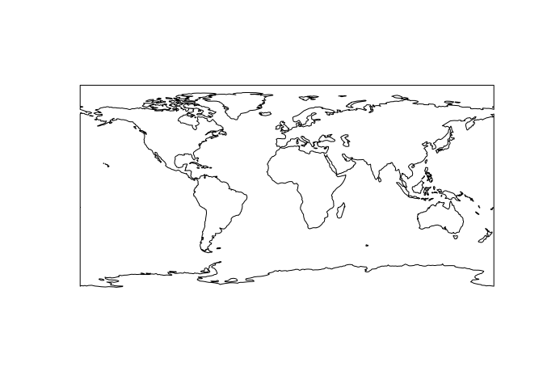

Tarea 1 Ciencia de datos espaciales
================

## Integrantes: Raimundo Moraga

This is an R Markdown format used for publishing markdown documents to
GitHub. When you click the **Knit** button all R code chunks are run and
a markdown file (.md) suitable for publishing to GitHub is generated.

## Including Code

You can include R code in the document as follows:

``` r
#install.packages("rnaturalearthhires")
oceanos <- ne_download(scale=110,type='ocean',category='physical')
sp::plot(ne_countries(country='united states of america',scale = 'small'))
```

    ## Warning in wkt(obj): CRS object has no comment

<!-- -->

``` r
sp::plot(oceanos)
```

<!-- -->

``` r
vignette('rnaturalearth', package='rnaturalearth')
```

    ## starting httpd help server ... done

``` r
poli <- oceanos@polygons[2]
poli[[1]]@Polygons[[3]]@area
```
